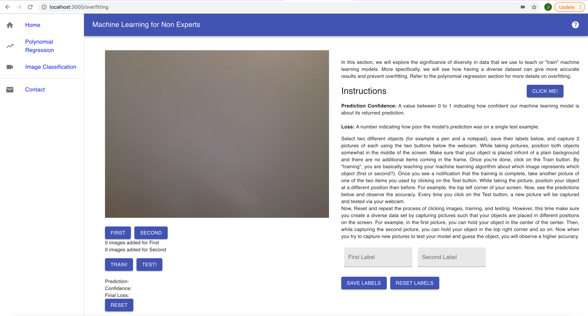

# Picture Classification in Your Browser

## Table of Contents

* [About the Project](#about-the-project)
    * [Done By](#done-by)
* [Deployment](#deployment)
* [Instructions for Installation](#instructions-for-installation)
* [Contributing](#contributing)


## About the Project
With this project, you can build and train a real-time image classification model. Everything happens within your browser and hence, you do not need additional resources like a significant amount of time or high computational power. This project was built using open source libraries like ml5.js and p5.js.


Instructions on how to use the interface are given on the respective screens.


**Image Classification:**

 

### Done By -
[**Neeha Hammad**](https://github.com/nhammad) - neeha.hammad@hotmail.com

### Deployment

A more extensive version of this project is deployed as a live website via **[Netlify](https://www.netlify.com/)**. It can be found here: https://mlfornonexperts.netlify.app/.

Instructions regarding how to deploy an app via Netlify can be found **[here](https://www.netlify.com/blog/2016/09/29/a-step-by-step-guide-deploying-on-netlify/)** .


## Instructions for Installation

To run the project locally in your browser (http://localhost:3000/), you first need to install the following:

1. Node.js

```
sudo apt-get install nodejs -y
```

2. Create React App
```
npm install -g create-react-app
```

Once these dependencies are installed, follow the steps given below:

1. Clone the repository

```
git clone https://github.com/nhammad/ML-for-Non-Experts.git
```

2. Open the project folder

```
cd ML-for-Non-Experts
```

3. Install dependencies 

```
npm install
```

4. Run the project

```
npm start
```

## Contributing

If you have more ideas for the application, feel free to contribute to it and help make educational ML more accessible. 

1. Fork the Project
2. Create your Feature Branch (`git checkout -b feature/Feature_Name`)
3. Commit your Changes (`git commit -m 'Added Feature_Name`)
4. Push to the Branch (`git push origin feature/Feature_Name`)
5. Open a Pull Request

